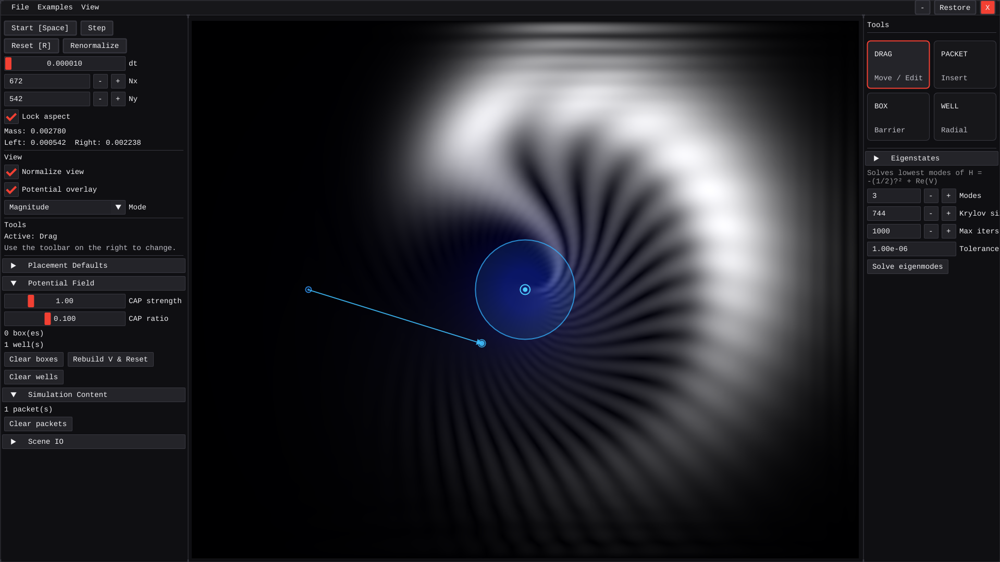
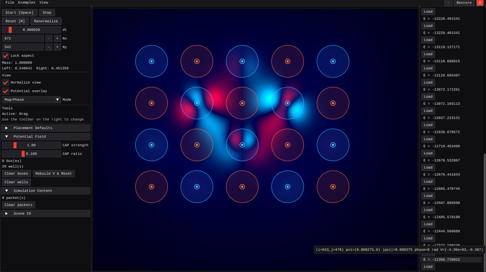

# Schrodinger2D — Interactive 2D Schrödinger Sandbox

An interactive C++17 sandbox to experiment with the time‑dependent 2D Schrödinger equation

  i ∂ψ/∂t = − (1/2) Δψ + V(x,y) ψ

with real‑time visualization, Gaussian wavepacket placement, and rectangular barrier/well potentials. The default solver is an unconditionally stable Crank–Nicolson ADI (alternating‑direction implicit) scheme with a complex absorbing potential (CAP) sponge near boundaries to reduce reflections.

Highlights
- GUI via Dear ImGui (bundled) + GLFW + OpenGL2 backend. If GLFW/OpenGL are not found, the project builds in headless mode and can run the smoke example via `--example`.
- Place Gaussian wavepackets by click+drag (drag sets initial momentum). Place rectangular potentials by click+drag.
- Start/Pause/Step, change `dt`, grid resolution, reset scene, and toggle view overlays (real/imag/magnitude/phase or combined mag+phase).
- Simple scene save/load (JSON) and a CLI smoke test (`examples/smoke_example.json`).
- Eigenvalue finder: solve low-lying eigenmodes of the current Hamiltonian, browse energies, and load eigenstates directly into the simulation.

Build
- Requirements
  - CMake ≥ 3.16
  - A C++17 compiler
  - Optional GUI: OpenGL and GLFW3
    - Linux: `sudo apt install libglfw3-dev` (Ubuntu/Debian) or equivalent
    - Windows: via vcpkg `vcpkg install glfw3` and CMake will detect `glfw3 CONFIG`
- Steps
  - `cd Schrodinger2D`
  - `cmake -S . -B build -DCMAKE_BUILD_TYPE=Release`
  - `cmake --build build --config Release`

Run
- GUI (if available): `./build/Release/Schrodinger2D.exe`
- Headless smoke example: `./build/Schrodinger2D --example examples/smoke_example.json`
  - Prints diagnostics: norm (mass) and left/right split as a proxy for reflection/transmission.

Controls (GUI)
- Space: start/pause
- R: reset (rebuilds ψ from defined packets and potentials)
- Delete: delete selected box
- Tool modes: Select/Move Boxes, Add Packet (drag = momentum), Add Box (drag = rectangle)
- Sliders: `dt`, grid `Nx, Ny`, CAP strength/ratio, packet params (amplitude, width `sigma`, momentum `k`), box height
- View: Magnitude+Phase (HSV), Real, Imag, Magnitude, Phase. Potential overlay can be toggled.

Numerics
- Equation: i ψ_t = −(1/2) Δψ + V ψ
- Scheme: Strang splitting where V is applied as diagonal “kicks”, and kinetic term T = −(1/2)Δ is stepped by ADI Crank–Nicolson:
  - Potential half-step: ψ ← exp(−i V Δt/2) ψ
  - ADI CN for T:
    - (I − α D_x) φ = (I + α D_y) ψ^n
    - (I − α D_y) ψ^{n+1} = (I + α D_x) φ
    - with α = i Δt / 4 and D_x, D_y the usual second differences (Dirichlet at edges)
  - Potential half-step again.
- Absorbing boundary: CAP adds a negative imaginary component near edges: V_cap = − i η(s), with a smooth ramp s∈[0,1]. This dampens outgoing waves to reduce reflections.
- Data: ψ stored as `std::complex<double>` on a uniform grid. Potential `V` supports real (boxes) + imaginary (CAP) parts.
- Defaults: Nx=Ny=128, dt=1e−3 are safe interactive values. CN-ADI is unconditionally stable; very large dt reduces accuracy, not stability. If the view saturates, either lower packet amplitude or enable Normalize View.

Optional FFT alternative
- If you prefer a spectral split-step method (SSFM) using FFTs, you can add an FFT library (e.g., FFTW, KissFFT) and implement `SSFM` in `src/sim/solver.cpp`. Keep the CN‑ADI as default for portability; FFTs are not required and not fetched by this project.

Code Layout
- `src/main.cpp` — entry point; GUI init when available; CLI `--example` runner otherwise.
- `src/ui/` — ImGui UI and simple OpenGL2 texture rendering.
- `src/sim/` — solver (CN‑ADI), potential (boxes + CAP), simulation harness (packets, steps, diagnostics).
- `src/io/` — minimal JSON scene save/load; example runner.
- `examples/` — `smoke_example.json` with single Gaussian + barrier.
- `third_party/imgui` — Dear ImGui (already provided).

Notes and heuristics
- Boundaries: Dirichlet for the ADI solves; CAP reduces reflection from the domain edges.
- Threading: The current build runs everything on the main thread for clarity and portability. A simple worker thread can be added around `sim.step()` guarded by a mutex if desired.
- Performance: Vectors are contiguous; the ADI tridiagonal solves are cache‑friendly row/column sweeps. Increase `-O3` for more speed.

Troubleshooting
- If GUI build fails, ensure GLFW is installed (see above). The project falls back to headless mode automatically.
- On Windows, ensure you link against the toolchain’s GLFW (vcpkg is straightforward). OpenGL2 backend avoids needing a GL loader.

License
- Licensed under the Apache License, Version 2.0. See `LICENSE`.
- No license headers are added. Dear ImGui is included in `third_party/` under its own license.
